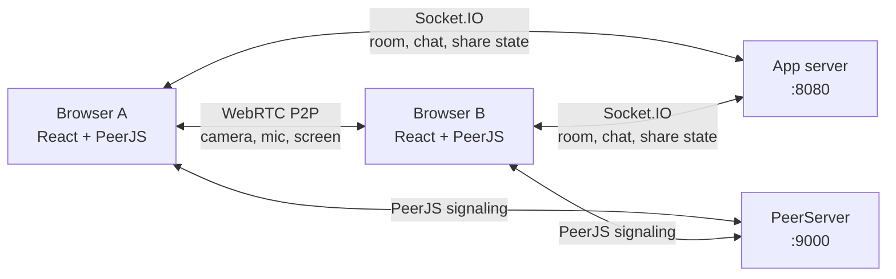

# Realtime Video Calling

Ứng dụng họp video trực tuyến nhiều người dùng, xây dựng bằng React, Socket.IO, PeerJS và WebRTC. Người dùng có thể tạo phòng, mời người khác bằng room ID, trao đổi tin nhắn, bật/tắt micro và chia sẻ màn hình trong khi vẫn giữ camera của người chia sẻ ở gallery.

> Đây là dự án học tập/prototype. User, meeting sessions và chat hiện được lưu trong MongoDB. Trước khi đưa lên production cần cấu hình HTTPS, TURN, chính sách bảo mật và quản lý secrets phù hợp.

## Tính năng

- Tạo phòng họp với room ID duy nhất.
- Tham gia phòng bằng room ID hoặc đường dẫn phòng.
- Gallery video co giãn theo số người; tile có avatar màu ổn định theo Peer ID.
- Gọi video và âm thanh giữa các trình duyệt bằng WebRTC P2P thông qua PeerJS.
- Chia sẻ màn hình riêng với video camera; dừng chia sẻ không làm mất camera.
- Người vào phòng khi đang có người chia sẻ sẽ được báo trạng thái và nhận luồng màn hình.
- Bật/tắt micro.
- Chat realtime và nhận lịch sử chat đang có trong phiên server.
- Đăng ký bằng email/mật khẩu có email verification.
- Đăng nhập bằng Google OAuth 2.0 / Google Identity Services.
- Phiên đăng nhập bằng cookie HttpOnly; Socket.IO yêu cầu session hợp lệ.
- Lưu users, phòng họp, thành viên/thời điểm tham gia, thời lượng và tin nhắn trong MongoDB.
- Trang chủ hiển thị lịch sử các phòng do tài khoản hiện tại tạo.
- Bố cục responsive cho desktop và màn hình nhỏ.

## Công nghệ

| Thành phần | Công nghệ | Vai trò |
| --- | --- | --- |
| Client | React, TypeScript, React Router, Tailwind CSS | Giao diện, trạng thái phòng và media local |
| API/auth/signaling server | Node.js, Express, Socket.IO, Mongoose | Xác thực, Mongo persistence, quản lý room, chat và trạng thái chia sẻ màn hình |
| Peer server | PeerJS | Trao đổi thông tin signaling để thiết lập WebRTC |
| Media | WebRTC | Truyền camera, micro và màn hình trực tiếp giữa các trình duyệt |

Socket.IO không truyền video. Nó chỉ gửi sự kiện điều khiển và chat; media đi qua kết nối WebRTC giữa các peer. Khi mạng/NAT không cho phép kết nối trực tiếp, ứng dụng hiện chưa cấu hình TURN relay.

## Kiến trúc tổng quan



## Luồng hoạt động

### Tạo và tham gia phòng

1. Người tạo bấm **Start new meeting**. Client gửi `create-room` qua Socket.IO.
2. Server tạo UUID cho phòng, đưa socket vào room và trả `room-created`.
3. Client chuyển đến `/room/:roomId`.
4. Khi PeerJS sẵn sàng và media local đã có, client gửi `join-room` kèm room ID và Peer ID.
5. Server thêm Peer ID vào danh sách, phát danh sách thành viên hiện có cho client mới và báo `user-joined` cho các client đang ở trong phòng.
6. Các peer thiết lập media call. Ứng dụng chọn một phía gọi theo thứ tự Peer ID để tránh gọi camera hai chiều trùng nhau.

Để mở cùng một phòng ở tab khác, nhập cùng room ID ở trang chủ hoặc mở lại đúng đường dẫn `/room/:roomId`. Không bấm tạo phòng mới ở tab thứ hai vì thao tác đó tạo room ID khác.

### Camera và micro

Client xin quyền camera/micro bằng `getUserMedia`. Camera local được gửi trong media call PeerJS; stream remote được lưu theo Peer ID và hiển thị trong gallery. Nếu trình duyệt không tìm thấy camera, client dùng Canvas stream giả lập để hỗ trợ kiểm tra giao diện. Nút micro tắt/bật audio track local.

### Chia sẻ màn hình

1. Người dùng bấm **Chia sẻ màn hình** và chọn cửa sổ/tab/màn hình trong hộp thoại của trình duyệt.
2. Client giữ nguyên camera stream, tạo một PeerJS media call riêng cho màn hình tới các peer đang tham gia.
3. Server phát sự kiện người đang chia sẻ; client mới nhận `sharingPeerId` cùng danh sách thành viên rồi được nối vào screen stream.
4. Bấm **Quay lại camera** hoặc dừng chia sẻ từ giao diện trình duyệt để đóng các screen call. Camera call vẫn tiếp tục.

### Chat

Tin nhắn được gửi qua Socket.IO đến các thành viên còn lại trong room. Server giữ lịch sử chat trong RAM và gửi lịch sử đó khi client join; lịch sử không được lưu sau khi tiến trình server dừng.

## Cấu trúc thư mục

```text
proj_1/
├── client/   # React app: pages, meeting/chat components, context và reducers
├── server/   # Express + Socket.IO: room, chat và trạng thái screen share
└── peerjs/   # PeerJS signaling server
```

## Yêu cầu

- Node.js và npm.
- Trình duyệt hỗ trợ WebRTC, `getUserMedia` và `getDisplayMedia`.
- Camera/microphone nếu muốn gửi media thật. Trên localhost, trình duyệt cho phép dùng các Media API; khi deploy cần HTTPS.

## Cài đặt và chạy local

Cài dependencies riêng trong các package:

```bash
cd proj_1/client
npm install

cd ../server
npm install

cd ../peerjs
npm install
```

Tạo các file cấu hình local từ template:

```bash
cp proj_1/server/.env.example proj_1/server/.env
cp proj_1/client/.env.example proj_1/client/.env
```

Trên Windows PowerShell có thể thay `cp` bằng `Copy-Item`. Điền các giá trị thật vào file `.env` local, không commit chúng:

- `proj_1/server/.env`: MongoDB URI, JWT secret, Google Client ID và thông tin SMTP.
- `proj_1/client/.env`: `REACT_APP_GOOGLE_CLIENT_ID` và `REACT_APP_API_URL`.
- Tạo Google OAuth 2.0 Web client trong Google Cloud Console; thêm `http://localhost:3000` vào Authorized JavaScript origins. Dùng cùng client ID ở client và server.
- Với Gmail SMTP, bật 2-Step Verification và tạo App Password mới riêng cho ứng dụng. Không dùng mật khẩu Gmail thường.
- Trong MongoDB Atlas, tạo database user riêng với quyền tối thiểu, giới hạn Network Access và đặt URI vào `MONGODB_URI`.
- Tạo `JWT_SECRET` ngẫu nhiên dài ít nhất 32 ký tự. Không đặt secret trong source code, README, GitHub hoặc chat.

Mở ba terminal riêng và chạy từng service:

**1. Socket.IO server, cổng 8080**

```bash
cd proj_1/server
npm run dev
```

**2. PeerJS server, cổng 9000**

```bash
cd proj_1/peerjs
npm run dev
```

**3. React client, cổng 3000**

```bash
cd proj_1/client
npm start
```

Mở `http://localhost:3000`. Tạo phòng ở tab đầu, sao chép room ID rồi dùng ID đó ở các tab tiếp theo.

> Các URL `localhost` của client và server đang được khai báo trực tiếp trong mã nguồn. Khi chạy trên máy khác hoặc deploy, cần cấu hình lại địa chỉ client, Socket.IO server, PeerServer và CORS cho đúng môi trường.

## Build và kiểm tra

```bash
cd proj_1/client
npm run build
```

```bash
cd proj_1/server
npm run build
```

Client dùng Create React App; test runner có thể chạy bằng:

```bash
cd proj_1/client
npm test
```

## Giới hạn và hướng phát triển

- History hiện tập trung vào các phòng do tài khoản tạo; sản phẩm đầy đủ cần thêm chính sách lưu phòng user tham gia, thời hạn lưu và xóa dữ liệu.
- Chưa có quên mật khẩu/resend verification, MFA, refresh-token rotation hoặc moderation.
- Media hiện dùng mesh P2P: mỗi trình duyệt kết nối trực tiếp với các peer khác. Khi số người tăng, băng thông và tải thiết bị tăng theo số kết nối; đây chưa phải kiến trúc SFU phù hợp cho phòng quy mô lớn.
- Chưa cấu hình STUN/TURN riêng cho production. Một số mạng doanh nghiệp, NAT hoặc firewall có thể chặn kết nối WebRTC.
- Các dịch vụ hiện được cấu hình cho local development; trước khi public cần HTTPS, CORS chỉ cho domain tin cậy, cookie/CSRF phù hợp, rate limits và secrets manager.
- Có thể phát triển tiếp: SFU (ví dụ mediasoup/LiveKit), TURN, lưu chat bền vững, tên/avatar tùy chỉnh, danh sách người tham gia, ghi nhận lỗi kết nối và test end-to-end.

## Đóng góp

1. Tạo branch cho thay đổi.
2. Giữ thay đổi tập trung và cập nhật README khi hành vi hoặc cách chạy thay đổi.
3. Chạy build client/server trước khi mở pull request.
