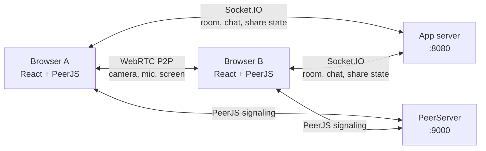

# Realtime Video Calling

Ứng dụng họp video trực tuyến nhiều người dùng, xây dựng bằng React, Socket.IO, PeerJS và WebRTC. Người dùng có thể tạo phòng, mời người khác bằng room ID, trao đổi tin nhắn, bật/tắt micro và chia sẻ màn hình trong khi vẫn giữ camera của người chia sẻ ở gallery.

> Đây là dự án học tập/prototype. Server hiện lưu room và lịch sử chat trong bộ nhớ; dữ liệu sẽ mất khi server khởi động lại. Chưa có đăng nhập, phân quyền phòng hoặc lưu trữ bền vững.

## Tính năng

- Tạo phòng họp với room ID duy nhất.
- Tham gia phòng bằng room ID hoặc đường dẫn phòng.
- Gallery video co giãn theo số người; tile có avatar màu ổn định theo Peer ID.
- Gọi video và âm thanh giữa các trình duyệt bằng WebRTC P2P thông qua PeerJS.
- Chia sẻ màn hình riêng với video camera; dừng chia sẻ không làm mất camera.
- Người vào phòng khi đang có người chia sẻ sẽ được báo trạng thái và nhận luồng màn hình.
- Bật/tắt micro.
- Chat realtime và nhận lịch sử chat đang có trong phiên server.
- Bố cục responsive cho desktop và màn hình nhỏ.

## Công nghệ

| Thành phần | Công nghệ | Vai trò |
| --- | --- | --- |
| Client | React, TypeScript, React Router, Tailwind CSS | Giao diện, trạng thái phòng và media local |
| Signaling/chat server | Node.js, Express, Socket.IO | Quản lý room, thành viên, sự kiện chat và trạng thái chia sẻ màn hình |
| Peer server | PeerJS | Trao đổi thông tin signaling để thiết lập WebRTC |
| Media | WebRTC | Truyền camera, micro và màn hình trực tiếp giữa các trình duyệt |

Socket.IO không truyền video. Nó chỉ gửi sự kiện điều khiển và chat; media đi qua kết nối WebRTC giữa các peer. Khi mạng/NAT không cho phép kết nối trực tiếp, ứng dụng hiện chưa cấu hình TURN relay.

## Kiến trúc tổng quan



## Luồng hoạt động

### Tạo và tham gia phòng

1. Người tạo bấm **Start new meeting**. Client gửi `create-room` qua Socket.IO.
2. Server tạo UUID cho phòng, đưa socket vào room và trả `room-created`.
3. Client chuyển đến `/room/:roomId`.
4. Khi PeerJS sẵn sàng và media local đã có, client gửi `join-room` kèm room ID và Peer ID.
5. Server thêm Peer ID vào danh sách, phát danh sách thành viên hiện có cho client mới và báo `user-joined` cho các client đang ở trong phòng.
6. Các peer thiết lập media call. Ứng dụng chọn một phía gọi theo thứ tự Peer ID để tránh gọi camera hai chiều trùng nhau.

Để mở cùng một phòng ở tab khác, nhập cùng room ID ở trang chủ hoặc mở lại đúng đường dẫn `/room/:roomId`. Không bấm tạo phòng mới ở tab thứ hai vì thao tác đó tạo room ID khác.

### Camera và micro

Client xin quyền camera/micro bằng `getUserMedia`. Camera local được gửi trong media call PeerJS; stream remote được lưu theo Peer ID và hiển thị trong gallery. Nếu trình duyệt không tìm thấy camera, client dùng Canvas stream giả lập để hỗ trợ kiểm tra giao diện. Nút micro tắt/bật audio track local.

### Chia sẻ màn hình

1. Người dùng bấm **Chia sẻ màn hình** và chọn cửa sổ/tab/màn hình trong hộp thoại của trình duyệt.
2. Client giữ nguyên camera stream, tạo một PeerJS media call riêng cho màn hình tới các peer đang tham gia.
3. Server phát sự kiện người đang chia sẻ; client mới nhận `sharingPeerId` cùng danh sách thành viên rồi được nối vào screen stream.
4. Bấm **Quay lại camera** hoặc dừng chia sẻ từ giao diện trình duyệt để đóng các screen call. Camera call vẫn tiếp tục.

### Chat

Tin nhắn được gửi qua Socket.IO đến các thành viên còn lại trong room. Server giữ lịch sử chat trong RAM và gửi lịch sử đó khi client join; lịch sử không được lưu sau khi tiến trình server dừng.

## Cấu trúc thư mục

```text
proj_1/
├── client/   # React app: pages, meeting/chat components, context và reducers
├── server/   # Express + Socket.IO: room, chat và trạng thái screen share
└── peerjs/   # PeerJS signaling server
```


